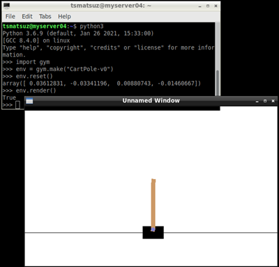

# Reinforcement Learning Algorithms Tutorial (Python)

This repository shows you theoretical fundamentals for typical reinforcement learning methods (model-free algorithms) with intuitive (but mathematical) explanations and several lines of Python code.

## Table of Contents

1. [Q-Learning](01-q-learning.ipynb)
2. [Policy Gradient method](02-policy-gradient.ipynb) (on-policy)
3. [Actor Critic method](03-actor-critic.ipynb)
4. [PPO (Proximal Policy Optimization)](04-ppo.ipynb) (on-policy)
5. [DDPG (Deep Deterministic Policy Gradient)](05-ddpg.ipynb) (off-policy)
6. [SAC (Soft Actor-Critic)](06-sac.ipynb) (off-policy)

All these examples are written in Python from scratch without any RL (reinforcement learning) libraries - such as, RLlib, Stable Baselines, etc.<br>
See [here (Minecraft example)](https://github.com/tsmatz/minecraft-rl-example) for building scripts with RLlib library.

## Example Environemnt (CartPole-v1)

In all examples, I commonly use a widely used CartPole environment (env).

See below for the specification of this environment (```CartPole-v1```) - such as, actions, states (observations), and rewards.

**Action Space** - Type : ```Discrete(2)```

- ```0``` : Push cart to the left
- ```1``` : Push cart to the right

**Observation Space** - Type : ```Box(-num, num, (4,), float32)```

- Cart Position ```(-4.8, 4.8)```
- Cart Velocity ```(-inf, inf)```
- Pole Angle ```(-0.41, 0.41)```
- Pole Velocity At Tip ```(-inf, inf)```

**Reward** - Type : ```float32```

It always returns ```1.0``` as reward.<br>
If completely succeeded, you can then take max ```500.0``` rewards in a single episode, because a single episode will be truncated on max ```500``` actions.

**Sample Code to run CartPole**

<ins>source code (Python)</ins>
 
```
import gym
import random

def pick_sample():
  return random.randint(0, 1)

env = gym.make("CartPole-v1")
for i in range(1):
  print("start episode {}".format(i))
  done = False
  s, _ = env.reset()
  while not done:
    a = pick_sample()
    s, r, term, trunc, _ = env.step(a)
    done = term or trunc
    print("action: {},  reward: {}".format(a, r))
    print("state: {}, {}, {}, {}".format(s[0], s[1], s[2], s[3]))
env.close()
```

<ins>output result</ins>

```
start episode 0
action: 0,  reward: 1.0
state: 0.006784938861824417, -0.18766506871206354, 0.0287443864274386, 0.27414982492533896
action: 0,  reward: 1.0
state: 0.0030316374875831464, -0.383185104857609, 0.03422738292594538, 0.5757584135859465
action: 1,  reward: 1.0
state: -0.004632064609569034, -0.18855925062821827, 0.04574255119766431, 0.2940515065957076
```

> Note : Call ```render()``` when you want to show the current state in visual UI as follows.<br>
> 

*Tsuyoshi Matsuzaki @ Microsoft*
